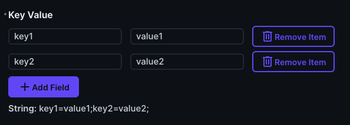
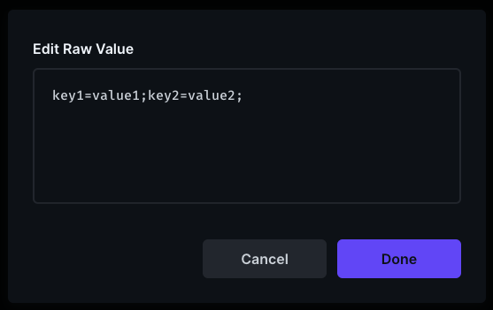

# Directus key / value parser

This interface allows you to parse a string (for ex: key1=value1;key2=value2;) so that update keys and values is much easier.

Your key / value pairs are saved as plain string

## Interface design

## The value saved in Database

You can't add a pair if the last one is empty.  
You can complete the rules with the ones that are available in Directus.